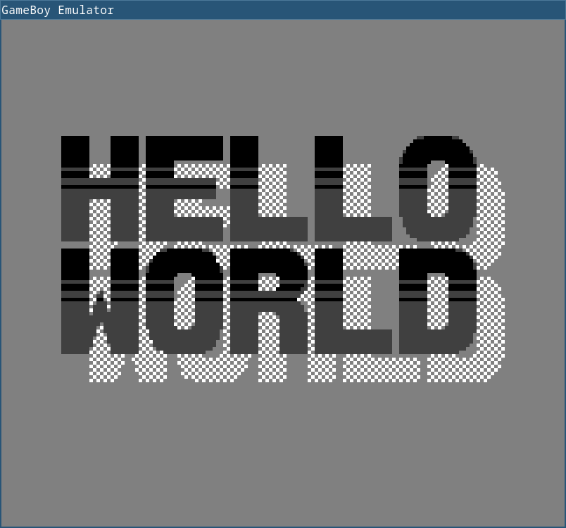

# GameBoy Emulator in C

## Dependencies
| OS / Distro           | Packages                |
|-----------------------|-------------------------|
| Arch-based (Manjaro)  | pkgconf sdl2            |
| Debian-based (Ubuntu) | pkg-config libsdl2-dev  |
| Fedora-based          | pkgconf-pkg-config SDL2 |

## Quick Start
```console
$ ./build.sh
$ ./gb <path to ROM>
```



## References
[Pan Docs](https://gbdev.io/pandocs/) \
[Gameboy Instruction set](https://www.pastraiser.com/cpu/gameboy/gameboy_opcodes.html) \
[LR35902 Assembler and Disassembler](https://github.com/herrhotzenplotz/lr35902as/) \
[GameBoy CPU Manual](http://marc.rawer.de/Gameboy/Docs/GBCPUman.pdf)

## License
[MIT](./LICENSE)
